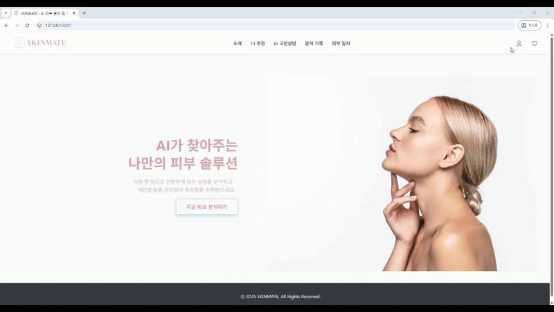
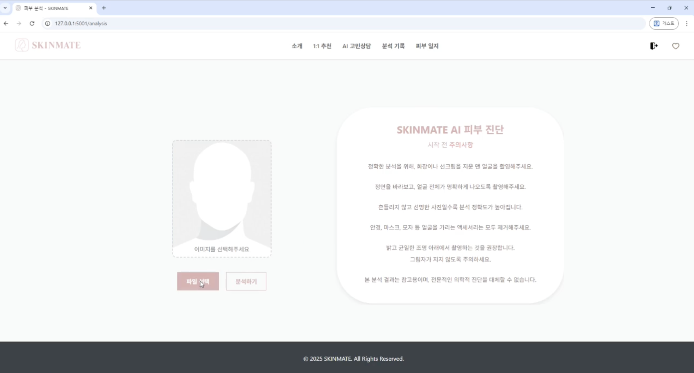
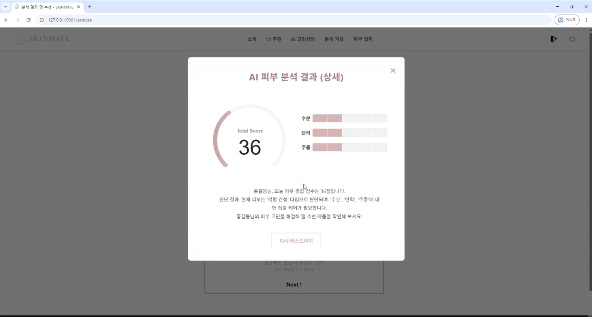
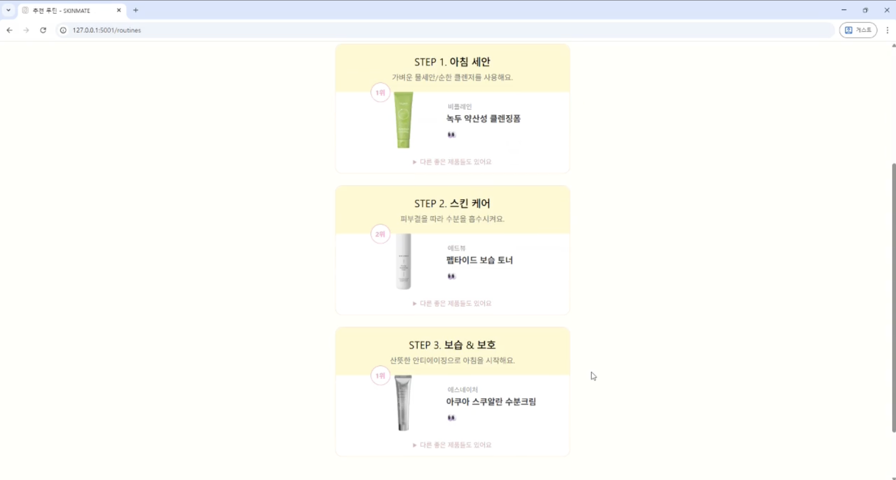

# 🌟 SKINMATE (Refactored Portfolio Version)



## ✨ 프로젝트 소개

SKINMATE는 AI 기반 피부 분석을 통해 사용자에게 맞춤형 스킨케어 루틴과
제품을 추천하는 서비스입니다.

본 프로젝트는 **팀 프로젝트로 개발한 클라우드 기반 AI 서비스**를\
👉 **개인 포트폴리오용으로 리팩토링하여 로컬에서도 실행 가능하도록
재구성한 버전**입니다.

------------------------------------------------------------------------

## 🔥 프로젝트 배경 및 리팩토링

### ✔ Original Team Project

-   Google Cloud Vertex AI 기반 피부 타입 분류
-   Cloud Run 배포 환경
-   4개 AI 모델 통합 분석 파이프라인

### ✔ Refactored Portfolio Version

-   Vertex AI 제거 → **로컬 실행 가능 구조로 변경**
-   Flask 기반 모듈 구조 재설계
-   분석 → 추천 → 기록 흐름 통합
-   외부 의존성 없이 실행 가능한 데모 서비스 구현

------------------------------------------------------------------------

## 🔑 주요 기능

-   AI 피부 분석 (TFLite 기반)
-   맞춤형 스킨케어 루틴 추천
-   피부 상태 점수 시각화
-   분석 기록 저장 및 조회
-   직관적인 UI/UX

------------------------------------------------------------------------

## 🛠 기술 스택

### Backend

-   Python, Flask

### Frontend

-   HTML, CSS, JavaScript

### Database

-   SQLite

### AI / 분석

-   TensorFlow Lite (TFLite)
-   Fallback heuristic logic

------------------------------------------------------------------------

## ⚙️ 실행 방법

``` bash
pip install -r requirements.txt
python app.py
```

접속: http://127.0.0.1:5001

------------------------------------------------------------------------

## 📸 실행 화면

### 메인



### 분석 결과



### 루틴 추천



------------------------------------------------------------------------

## 🚀 핵심 포인트

-   클라우드 기반 AI 서비스 → 로컬 실행형으로 재구성
-   서비스 구조 분리 (auth / service / route)
-   실제 동작 가능한 포트폴리오 서비스 구현

------------------------------------------------------------------------

## 📌 한 줄 요약

AI 피부 분석 서비스를 클라우드 의존 구조에서\
로컬 실행 가능한 포트폴리오 서비스로 리팩토링한 프로젝트입니다.
